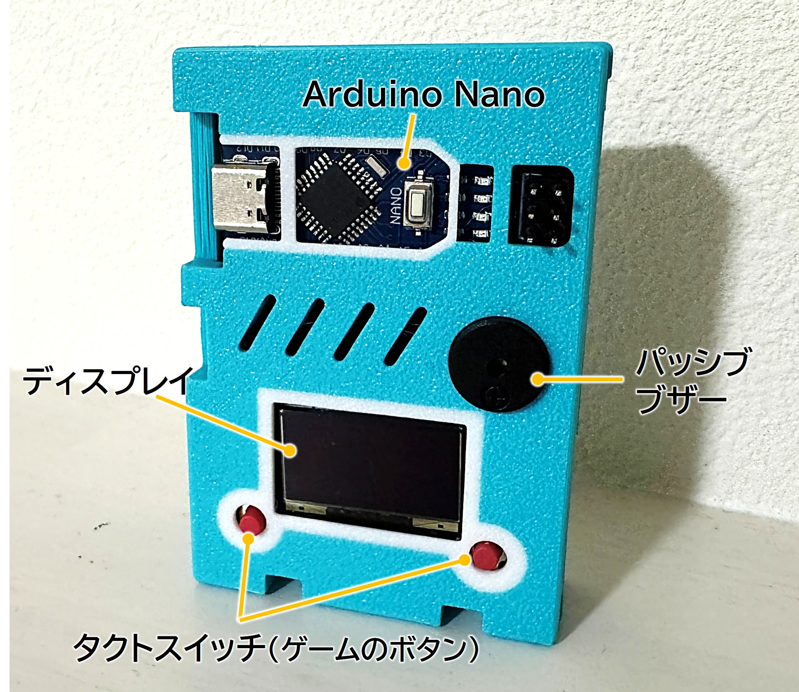

# BM-GamePod
BM(ブレッドメイカー)シリーズの誰でも簡単に作れるシンプルなゲーム機です。


# 自作小型ゲーム機プロジェクト



## 概要
本リポジトリは、自作した小型ゲーム機の  
- **ケース(3Dプリンタ用 / 素材：PLA)**
- **ゲームのソースコード**
- **キャラクタの変更方法の紹介()**

を公開するものです。

自分でケースを出力し、ソフトを書き込むことで、  
オリジナルの小型ゲーム機として動作します。
(キット購入の方は、ケースの出力は不要です)
ハードの説明と組み立て方は、ProtoPedia GamePodの記事(<a href="https://protopedia.net/prototype/private/e5fad012-32e8-4cfa-9808-c9ff6ae638b0">@YugiTechLab</a>)を参考にしてください。

---

## Links


## Firmware（Arduino）

- スケッチ：`sw/bm_gamepod/bm_gamepod.ino`

### ビルド/書き込み
1. Arduino IDE で `sw/bm_gamepod/bm_gamepod.ino` を開く
2. ボード/ポートを選択して書き込み

※ 依存ライブラリや配線はスケッチ内コメントを参照してください。

---

### Tools（ブラウザで動く）
- OLED Dot Editor  
  https://yugi-tech-lab.github.io/BM-GamePod/sw/tools/oled_dot_editor.html

## Hardware

- STL：`hw/stl/bm_gamepod.stl`

---

## Folder Structure


```
BM-GamePod/
├─ index.html
├─ LICENSE
├─ README.md
├─ .gitignore
├─ .gitattributes
├─ assets/
│  ├─ img/
│  └─ icons/
├─ docs/
│  ├─ wiring.md
│  ├─ bom.md
│  └─ howto.md
├─ hw/
│  ├─ README.md
│  └─ stl/
│     └─ bm_gamepod.stl
└─ sw/
   ├─ tools/
   │  ├─ README.md
   │  ├─ config.js
   │  └─ oled_dot_editor.html
   └─ bm_gamepod/
      ├─ README.md
      └─ bm_gamepod.ino
```

---

## License

TBD（必要に応じて追記してください）
- 例：MIT / Apache-2.0 / CC BY など

---

## Author / Community

- yugi-tech-lab  
  https://github.com/yugi-tech-lab
